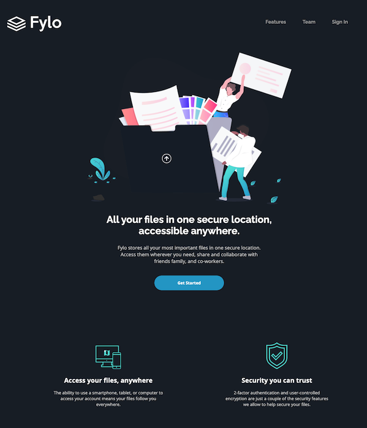

#Fylo

A landing page built using HTML and CSS. It uses the grid layout which makes it responsive.

You can access it by clicking <a href="https://suheybhersi.github.io/Fylo/">here</a>

<h2>Web Preview</h2>

 
<h2>Mobile Preview</h2>

## Colors

### Primary

- Dark Blue (intro and email sign up background): hsl(217, 28%, 15%)
- Dark Blue (main background): hsl(218, 28%, 13%)
- Dark Blue (footer background): hsl(216, 53%, 9%)
- Dark Blue (testimonials background): hsl(219, 30%, 18%)

### Accent

- Cyan (inside call-to-action gradient): hsl(176, 68%, 64%)
- Blue (inside call-to-action gradient): hsl(198, 60%, 50%)
- Light Red (error): hsl(0, 100%, 63%)

### Neutral

- White: hsl(0, 0%, 100%)

## Typography

### Body Copy

- Font size: 14px

### Headings, Call-to-actions, Header Navigation

- Family: [Raleway](https://fonts.google.com/specimen/Raleway)
- Weights: 400, 700

### Body

- Family: [Open Sans](https://fonts.google.com/specimen/Open+Sans)
- Weights: 400, 700
